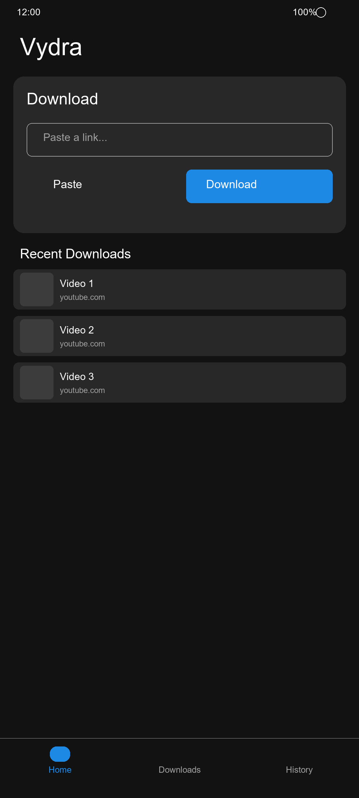
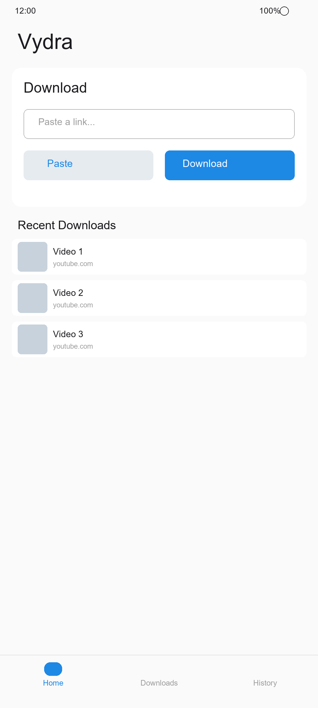
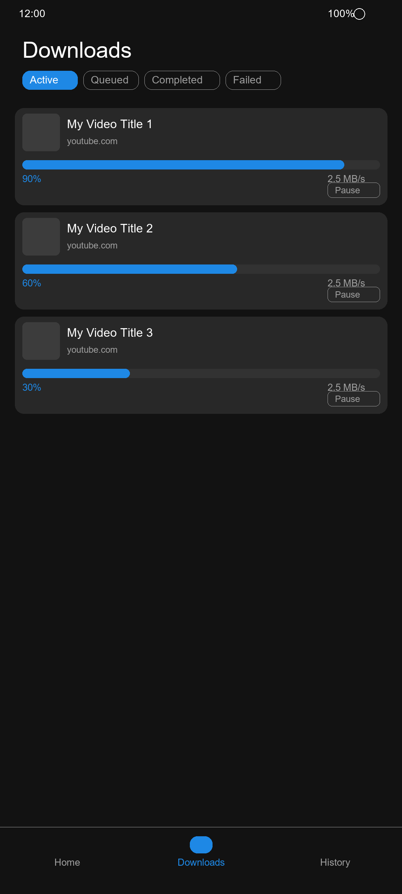
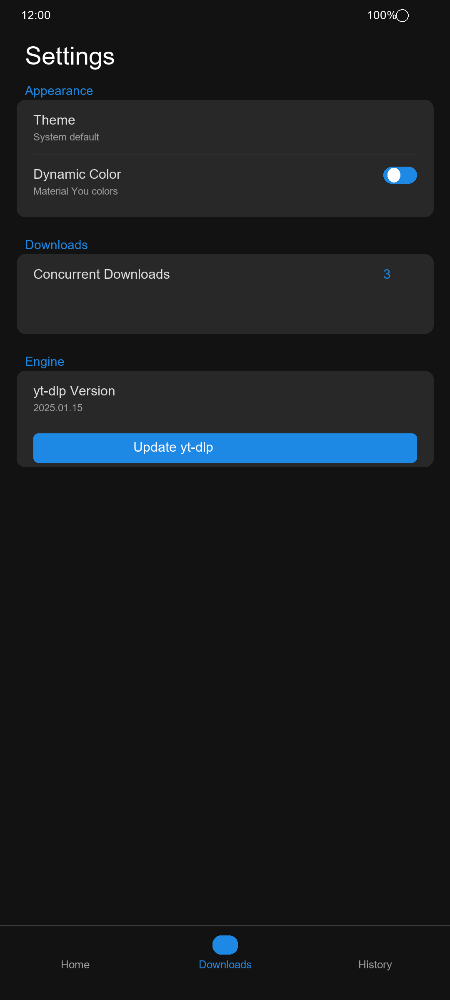

# Vydra

<p align="center">
  
  
  
  
</p>

**Vydra** is a fast, lightweight, open-source Android downloader powered by yt-dlp. Download videos and audio from YouTube, Instagram, TikTok, Twitter, Reddit, Vimeo, Twitch, SoundCloud, and hundreds more websites.

---

## Features

- Download from **1000+ websites** via yt-dlp
- **Video** and **Audio-only** downloads
- Multiple quality/format selection (MP4, WEBM, MKV, MP3, M4A, FLAC, OGG, WAV)
- **Material Design 3** with Dynamic Color / Material You
- Light, Dark, and **AMOLED Black** themes
- **Android Share Target** — share any URL from any app
- Foreground service with progress notifications
- Pause, resume, and cancel downloads
- Download history with search and filters
- Fully offline — **no analytics, no trackers, no ads**
- Lightweight, battery-friendly, responsive on low-end devices

---

## Screenshots

<p align="center">
  
  
  
  
</p>

---

## Installation

### Download

Get the latest APK from [**Releases**](https://github.com/imaan-jaman/Vydra/releases/latest).

### Build from source

```bash
git clone https://github.com/vydra-app/vydra.git
cd vydra
./gradlew assembleDebug
```

The debug APK will be at `app/build/outputs/apk/debug/app-debug.apk`.

---

## Architecture

Vydra follows clean architecture with MVVM:

```
com.vydra.app/
├── data/           # Room database, DataStore, repository implementations
├── di/             # Hilt dependency injection modules
├── domain/         # Models, repository interfaces, use cases
├── engine/         # yt-dlp engine wrapper
├── service/        # Foreground download service
└── ui/             # Jetpack Compose UI
    ├── components/ # Reusable composables
    ├── navigation/ # Navigation graph
    ├── screens/    # Feature screens (Home, Downloads, History, Search, Settings)
    ├── share/      # Share target activity
    └── theme/      # Material 3 theme
```

### Tech Stack

| Layer | Technology |
|-------|-----------|
| UI | Jetpack Compose + Material 3 |
| Architecture | MVVM + Repository Pattern |
| DI | Hilt |
| Database | Room |
| Preferences | DataStore |
| Background | WorkManager + Foreground Service |
| Images | Coil |
| Serialization | kotlinx.serialization |
| Download Engine | yt-dlp + FFmpeg |

---

## Contributing

See [CONTRIBUTING.md](CONTRIBUTING.md) for guidelines.

---

## Credits

- [yt-dlp](https://github.com/yt-dlp/yt-dlp) — The download engine
- [FFmpeg](https://ffmpeg.org/) — Media processing
- [Jetpack Compose](https://developer.android.com/jetpack/compose) — UI toolkit
- [Material Design 3](https://m3.material.io/) — Design system

---

## License

Vydra is licensed under the [GPL-3.0 License](LICENSE).

---

## FAQ

**Q: What websites are supported?**
A: Any website supported by yt-dlp — over 1000 sites including YouTube, Instagram, TikTok, Twitter/X, Reddit, Twitch, Vimeo, SoundCloud, and more.

**Q: Does it download from YouTube?**
A: Yes, via yt-dlp's extractor system.

**Q: Is there a iOS version?**
A: Not currently. Vydra is Android-only.

**Q: Is it on Google Play?**
A: Not yet. Download from GitHub Releases.

---

## Roadmap

- [ ] yt-dlp auto-update
- [ ] Playlist/batch downloads
- [ ] Subtitle download support
- [ ] Custom yt-dlp command builder
- [ ] aria2c integration for faster downloads
- [ ] Localization (multi-language)
- [ ] Widget for quick downloads
